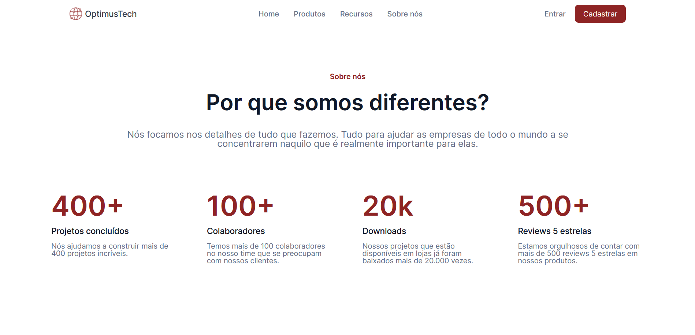

## 📸Imagem do projeto

  

## 🖥️Sobre o projeto
Esse é um projeto de uma página de divulgação de vagas de uma empresa fictícia, foi baseado em um <a href="https://www.figma.com/file/mm3MLozvUDGhDRTxSLlGL5/7daysOfCode-HTML-CSS?type=design&node-id=0-9878&mode=design&t=UqyTNN5VtFxBtMYi-0">modelo do figma</a> disponibilizado pela Alura.

## 🚀Tecnologias utilizadas
Esse projeto foi desenvolvido durante o 7 days of code da Alura com as seguintes tecnologias: 
-HTML 
-CSS 
-Figma 
-Git e GitHub